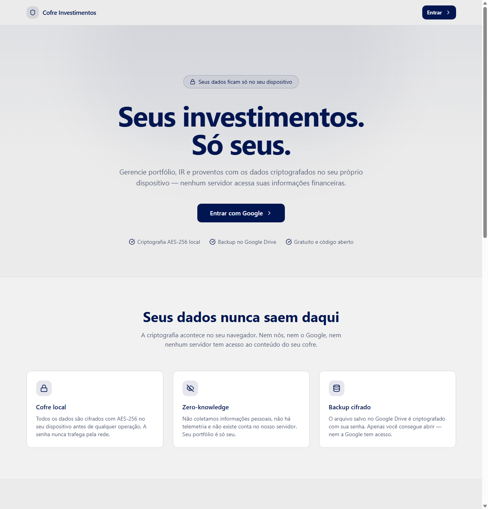

# Cofre Investimentos

**Seus investimentos. Só seus.**

App gratuito e open source de gestão de investimentos com **criptografia local** —
seus dados financeiros (portfólio, transações, proventos, IR) nunca saem do seu
dispositivo. Nenhum servidor nosso armazena ou acessa suas informações.

🔗 **App:** [cofreinvestimentos.com.br](https://cofreinvestimentos.com.br)

[](LICENSE)



---

## Funcionalidades

- 📊 **Portfólio** — multi-carteira, cotas, preço médio, P&L e ganho do dia consolidados
- ⚖️ **Balanceamento** — sugestões automáticas de compra por aporte ou rebalanceamento sem venda
- 💰 **Proventos** — dividendos, JCP e rendimentos com histórico e Yield on Cost
- 🧾 **Imposto de Renda** — DARF automático, isenção de R$20k, GCAP e swing trade calculados
- ☁️ **Backup no Google Drive** — o arquivo salvo no Drive é criptografado; nem a Google consegue abrir
- 📥 **Importação B3** — CSV de Negociação, Movimentação e Tesouro Direto
- 🔐 **Zero-knowledge** — criptografia AES-256 local (Web Crypto API), com unlock opcional via Windows Hello/biometria (WebAuthn PRF)

## Tecnologias

- **Vite** + **React 18** + **TypeScript**
- **shadcn-ui** + **Tailwind CSS**
- **React Router** (roteamento client-side)
- **Login com Google** via Google Identity Services (OAuth direto, sem Firebase)
- **Supabase** (Edge Functions de cotações) e backup no **Google Drive**

## Desenvolvimento local

Pré-requisito: Node.js & npm instalados ([instalar com nvm](https://github.com/nvm-sh/nvm#installing-and-updating)).

```sh
# 1. Clonar o repositório
git clone https://github.com/claudiorico/gestao-de-ativos-ai.git

# 2. Entrar na pasta do projeto
cd gestao-de-ativos-ai

# 3. Instalar dependências
npm i

# 4. Subir o servidor de desenvolvimento (http://localhost:8080)
npm run dev
```

## Variáveis de ambiente

Crie um arquivo `.env` na raiz (ou configure no provedor de deploy) com:

```
VITE_GOOGLE_CLIENT_ID=...        # OAuth Client ID do app (login com Google)
VITE_SUPABASE_URL=...
VITE_SUPABASE_PROJECT_ID=...
VITE_SUPABASE_PUBLISHABLE_KEY=...
```

> **Login com Google:** o app usa um único `VITE_GOOGLE_CLIENT_ID` (OAuth Web do Google Cloud).
> O usuário só clica em "Entrar com Google" e autentica na própria conta Google. Há também um
> modo avançado "usar meu próprio Client ID" para quem quiser OAuth próprio (zero-knowledge total).
> O Client ID OAuth de SPA é público por natureza — não é segredo.

> Como é um app Vite, as variáveis `VITE_*` são incorporadas no momento do **build**.
> No deploy, defina-as no provedor antes de buildar.

## Build

```sh
npm run build      # gera a versão de produção em dist/
npm run preview    # serve o build localmente para conferência
```

## Deploy (Vercel)

1. Faça push para o GitHub.
2. Em [vercel.com](https://vercel.com) → **Add New → Project** → importe este repositório.
3. Framework Preset **Vite** (build `npm run build`, output `dist`) — já coberto pelo `vercel.json`.
4. Cadastre as variáveis `VITE_*` em **Settings → Environment Variables**.
5. **Google Cloud Console → APIs & Services → Credentials**, no OAuth Client ID (tipo
   *Web application*) usado em `VITE_GOOGLE_CLIENT_ID`:
   - **Authorized JavaScript origins**: `http://localhost:8080` e `https://<app>.vercel.app`.
   - Configure a **OAuth consent screen** (test users ou publicado), senão o popup falha.
6. **Deploy**.

O `vercel.json` já inclui o rewrite de SPA, garantindo que rotas profundas (ex.: `/portfolio`)
funcionem ao recarregar a página.

## Backend (Supabase Edge Functions)

As cotações usam as functions `get-quotes` e `get-price-history`. Para atualizá-las:

```sh
supabase functions deploy get-quotes get-price-history
# opcional: liberar a origem do app por host
supabase secrets set ALLOWED_ORIGIN_HOSTS=seu-app.vercel.app
```

## Contribuindo

PRs e issues são bem-vindos! Se encontrar um bug ou tiver uma sugestão, abra uma
[issue](https://github.com/claudiorico/gestao-de-ativos-ai/issues).

## Licença

[MIT](LICENSE)
